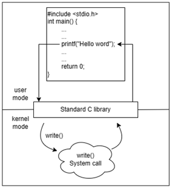
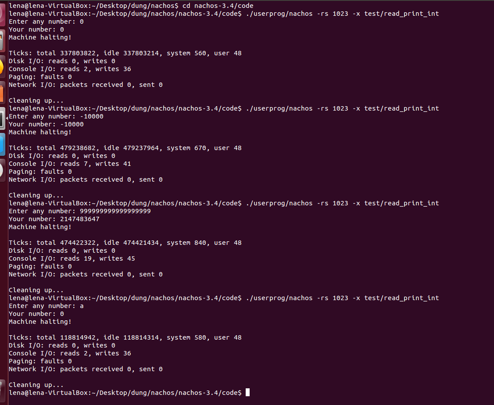
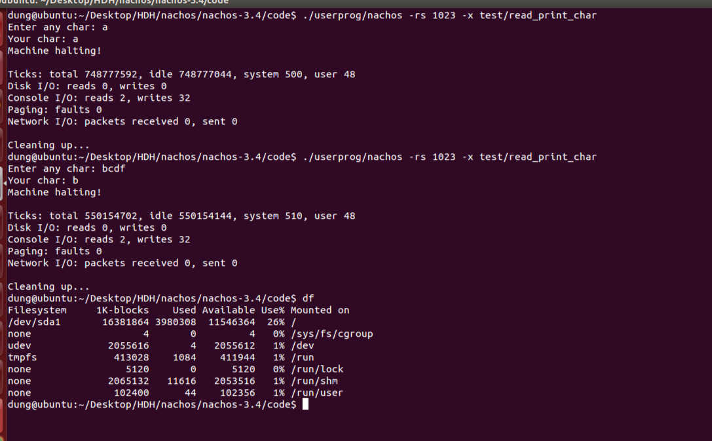
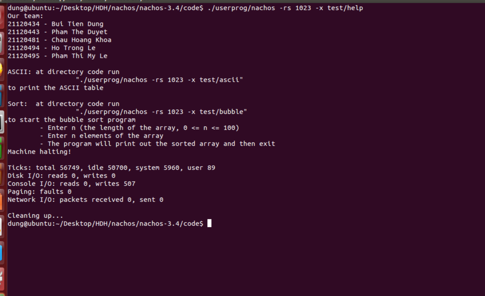
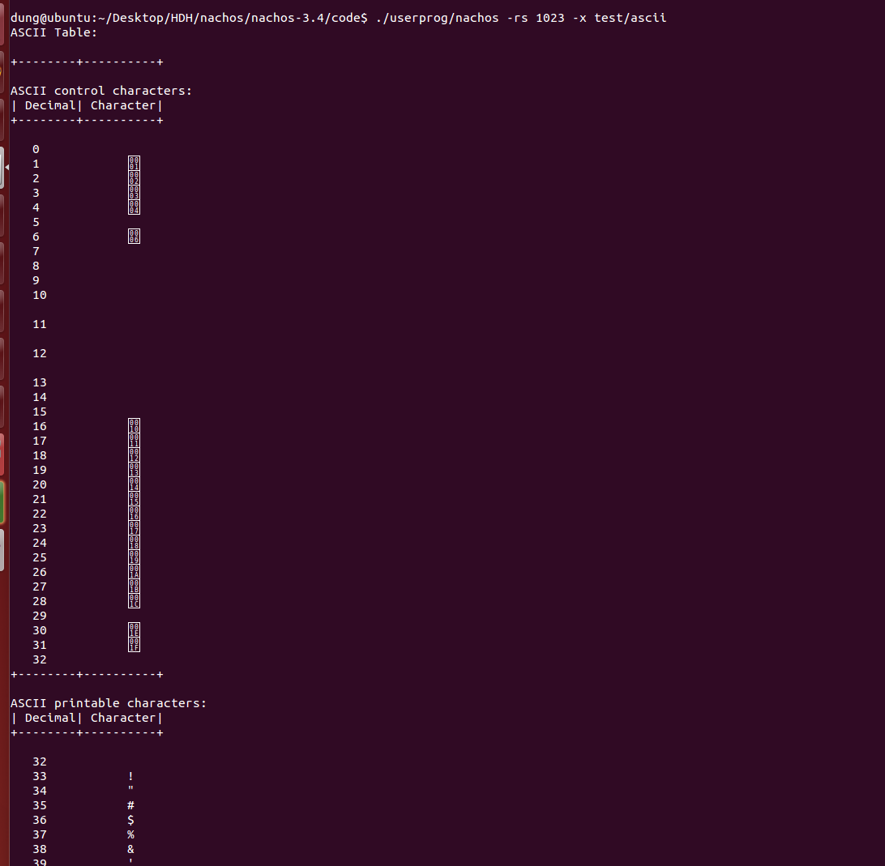
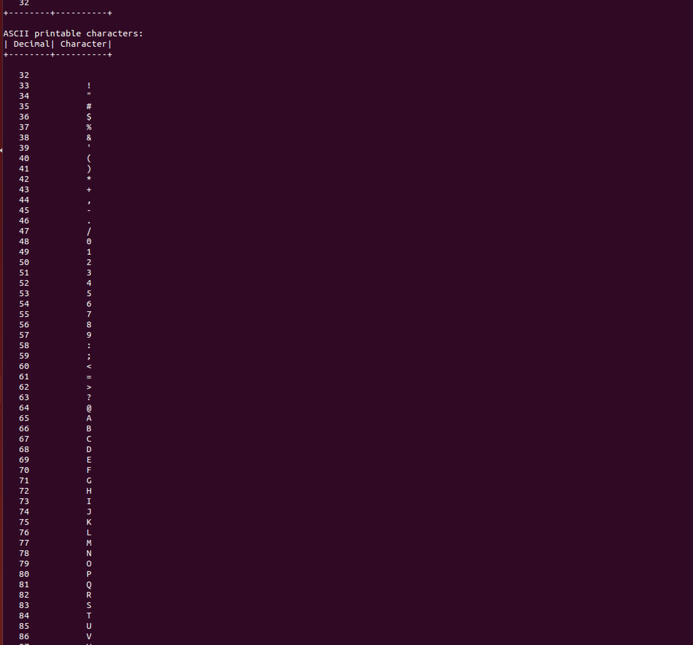
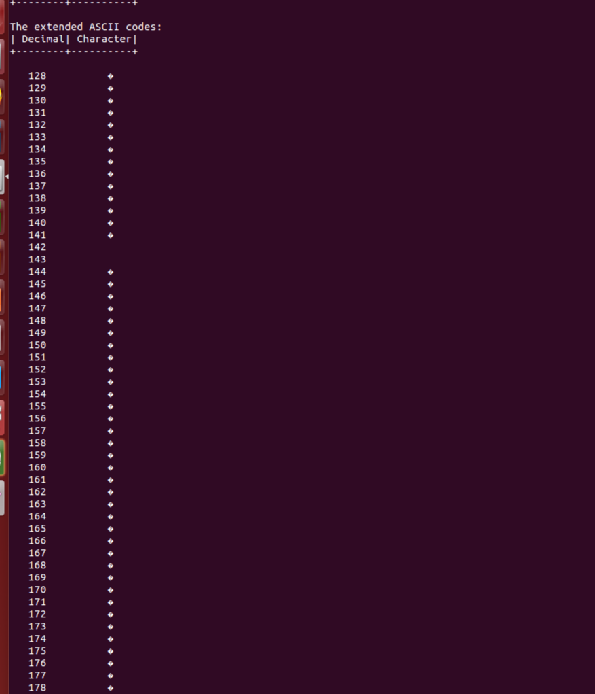
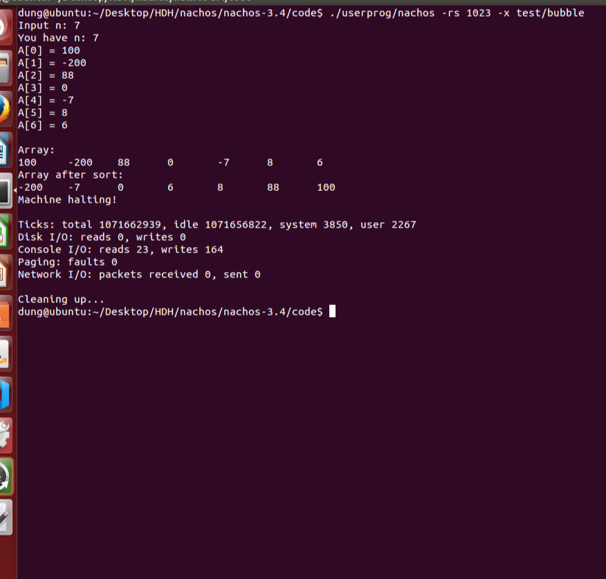

# Báo Cáo
## 1. Phân công công việc
|STT|MSSV|Họ tên|Công việc được giao|Công việc chưa hoàn thành|Mức độ được|
|---|-----|-------|-----|-----------|-------|
|1|21120434|Bùi Tiến Dũng|J,K,L
|2|21120443|Phạm Thế Duyệt|H,I
|3|21120481|Châu Hoàng Khoa|A,B,C
|4|21120494|Hồ Trọng Lễ|F,G
|5|21120495|Phạm Thị Mỹ Lệ|D,E

 ## 2. Giới thiệu về nachos
 ### 2.1. Tổng quan

 - Nachos là một phần mềm mã nguồn mở (open source) giả lập một máy tính ảo và một số thành phần cơ bản của hệ điều hành chạy trên máy tính ảo này nhằm giúp cho việc tìm hiểu và xây dựng các thành phần phức tạp hơn của hệ điều hành
   - Máy ảo được giả lập có kiến trúc MIPS với hầu hết các thành phần
       và chức năng của một máy thật như: thanh ghi, bộ nhớ, bộ xử lý,
       bộ lệnh, chu kỳ thực thi lệnh, cơ chế ngắt, chu kỳ đồng hồ, …
    - Hệ điều hành Nachos chạy trên máy ảo Nachos là một hệ điều hành đơn chương
       
### 2.2 Giao tiếp giữa HĐH và chương trình người dùng
#### 2.2.1 Mô hình

#### 2.2.2 Giao tiếp giữa hệ điều hành và chương trình người dùng
- Cũng tương tự như mô hình giao tiếp chung giữa HĐH và chương trình người dùng ở trên, mỗi chương trình trong hệ thống phải có các thông tin cục bộ của nó, bao gồm program counters, registers, stack pointers, và file system handler. Mặc dù user program truy cập các thông tin cục bộ của nó, nhưng HĐH điều khiển các truy cập này, HĐH đảm bảo các yêu cầu từ user program tới kernel không làm cho HĐH sụp đổ. Việc chuyển quyền điều khiển từ user mode thành system mode được thực hiện thông qua system calls, softwave interrupt/trap. Trước khi gọi một lệnh trong hệ thống thì các tham số truyền vào cần thiết phải được nạp vào các thanh ghi của CPU. Để chuyển một biến mang giá trị, tiến trình chỉ việc ghi giá trị vào thanh ghi. Để chuyển một biến tham chiếu, thì giá trị lưu trong thanh ghi được xem như là “user space pointer”. Bởi vì user space pointer không có y nghĩa đối với kernel, mà chúng ta cần là chuyển nội dung từ user space vào kernel sao cho ta có thể xử lý dữ liệu này. Khi trả thông tin từ system về user space, thì các giá trị phải đặt trong các thanh ghi của CPU
- Tuy nhiên Nachos là một HĐH nhỏ gọn nhằm mục đích phục vụ cho việc
   tìm hiểu và xây dựng HĐH nên có một số đặc điểm riêng.
- Các chương trình được viết trên hệ điều hành NachOS được viết trong
   thư mục /code/test.
- Trước khi chương trình này có thể thực thi được, nó phải được biên
   dịch. Đối với Nachos, tất cả các chương trình trong thư mục
   /code/test/ đều được biên dịch khi biên dịch Nachos, tuy nhiên ta
   hoàn toàn có thể biên dịch các chương trình này mà không cần phải
   biên dịch lại Nachos như sau:

**% …../cross-compiler/decstation-ultrix/bin/gcc -I …../nachos/code/userprog -I…../nachos/code/threads -o ……/test/filename …./test/filename.c**

- Quá trình biên dịch chương trình này gồm 3 giai đoạn như sau:
  + Chương trình filename.c được biên dịch bởi cross-compiler gcc (được tạo ra trong bài “Biên dịch và Cài đặt Nachos”) thành tập tin filename.s là mã hợp ngữ chạy trên kiến trúc MIPS.
  + Tập tin filename.s này sẽ được liên kết với tập tin start.s để tạo thành tập tin filename.coff, là định dạng thực thi trên hệ điều hành Linux cho kiến trúc máy MIPS. (Lưu ý, do Nachos được xây dựng đơn giản nhằm mục đích giúp tìm hiểu nên người ta sử dụng tập tin start.s thay cho toàn bộ thư viện C trong mô hình chung ở trên.)
  + Tập tin filename.coff được chuyển thành tập tin filename.noff, là định dạng thực thi trên hệ điều hành Nachos cho kiến trúc máy MIPS, sử dụng tiện ích “coff2noff” được cung cấp sẵn trong thư mục /code/bin/
 ### 2.3 Quá trình ngắt và sử lí ngoại lệ
-	Trên máy thật cần có cơ chế trả lại quyền điều khiển từ chương trình người dùng đang chạy cho hệ điều hành. Tương tự, ở Nachos cần có cơ chế trả lại quyền điều khiển cho hệ điều hành từ mô phỏng máy. Giống như trên một máy thật, điều này được thực hiện trong Nachos bằng các ngắt và ngoại lệ. Một ngoại lệ xảy ra khi chương trình người dùng đang chạy thực hiện lệnh gọi hệ thống hoặc khi nó cố gắng thực hiện một thao tác bất hợp pháp (chẳng hạn như chia cho 0 hoặc truy cập vào phần bị cấm trong bộ nhớ của máy mô phỏng). Khi xảy ra ngoại lệ, mô phỏng máy sẽ gọi hàm xử lý ngoại lệ, là một phần của hệ điều hành. Hàm xử lý ngoại lệ Nachos có trong tệp code/userprog/exception.cc .
-	Khi trình xử lý ngoại lệ được gọi, hệ điều hành lại có quyền kiểm soát. Thông thường, công việc của nó là tìm ra lý do tại sao ngoại lệ xảy ra và thực hiện một số hành động để giải quyết nó. Nếu ngoại lệ xảy ra do lệnh gọi hệ thống gây ra, hệ điều hành sẽ thực hiện dịch vụ được chương trình người dùng yêu cầu, ví dụ: ghi một ký tự vào bảng điều khiển hoặc mở tệp. Nếu chương trình thực hiện một thao tác bất hợp pháp, hệ điều hành phải quyết định phải làm gì, ví dụ: nó có thể đơn giản chấm dứt một chương trình người dùng đang cố gắng chia cho 0.
-	Hệ điều hành cho biết rằng nó đã xử lý xong ngoại lệ bằng cách quay trở lại từ chức năng xử lý ngoại lệ của nó. Việc này trả lại quyền điều khiển cho mô phỏng máy, một lần nữa bắt đầu tìm nạp và thực hiện các hướng dẫn chương trình của người dùng.
-	Ngắt rất giống với ngoại lệ. Tuy nhiên, chúng không phải do các hướng dẫn được thực thi bởi chương trình người dùng đang chạy. Đúng hơn, các ngắt là do các thành phần phần cứng khác của máy mô phỏng gây ra: đĩa, bảng điều khiển, giao diện mạng và bộ hẹn giờ. Ví dụ: bảng điều khiển mô phỏng tạo ra một ngắt bất cứ khi nào có ký tự đầu vào mới từ bàn phím. Mỗi khi nó thực hiện xong một lệnh chương trình người dùng, mô phỏng phần cứng sẽ kiểm tra xem một trong các thiết bị này có sẵn sàng gây ra gián đoạn hay không. Nếu vậy, mô phỏng phần cứng sẽ gọi chức năng xử lý ngắt của hệ điều hành thay vì thực hiện lệnh chương trình người dùng tiếp theo.
-	Giống như trình xử lý ngoại lệ, trình xử lý ngắt là một chức năng của hệ điều hành. Khi trình xử lý ngắt kết thúc, nó sẽ trả về. Việc này trả lại quyền điều khiển cho mô phỏng phần cứng, sau đó tiến hành thực hiện lệnh chương trình người dùng tiếp theo.
-	Có một số loại ngắt: một cho đĩa, một cho bộ đếm thời gian và hai cho bàn điều khiển và mạng. Đối với mỗi loại ngắt, hệ điều hành phải cung cấp một trình xử lý ngắt riêng. Mô phỏng phần cứng gọi trình xử lý thích hợp khi xảy ra một loại gián đoạn cụ thể.

  ## 3. Cài đặt
  ### 3.1 Thêm lớp *SynchConsole* vào Nachos
  ### 3.2 Cài đặt hàm *AdvancePC()*
  - Hàm này được dùng để tăng thanh ghi program counter
  - Các bước thực hiện:
    - Lưu giá trị trong thanh ghi PC hiện tại vào thanh ghi PC trước
    - Lưu giá trị của thanh ghi PC kế tiếp vào thanh ghi PC hiện tại
    - Tăng giá trị của thanh ghi PC kế tiếp lên 4 đơn vị
  ### 3.3 Cài đặt và thêm 2 hàm *User2System* và *System2User* vào trong *exception.cc*
  ### 3.4 Cài đặt lại các *exception*
  ### 3.5 Cài đặt system call *int ReadInt()*
  - Các bước thực hiện:
    - Bước 1: Sử dụng hàm **Read** của **SynchConsole** để đọc dữ liệu người dùng nhập vào, lưu vào vùng nhớ char* buf.
    - Bước 2: Bỏ qua kí tự khoảng trắng ' ' và  số '0' ở đầu  buf nếu có. (vd: '0005', '    5')
    - Bước 3: Kiểm tra đầu chuỗi có kí tự '-' hay không (nếu có thì số người dùng nhập là số âm).
    - Bước 4: Kiểm tra trong chuỗi có kí tự khác chữ số
      - Tồn tại kí tự '.': kiểm tra các kí tự phía sau '.', đều là '0'  (vd: 1.00000) -> đầu vào hợp lệ.
      - Còn lại: đầu vào không hợp lệ -> trả về 0.
    - Bước 5: Chuyển đầu vào hợp lệ sang kiểu int.
    - Bước 6: Trả kết quả: số int ở bước 5.
 **Trả kết quả: ghi giá trị kết quả vào thanh ghi số 2 ($v0)**
  - Demo:
  
  ### 3.6 Cài đặt system call *void PrintInt(int number)*
  - Các bước thực hiện:
    - Bước 1: Đọc giá trị số nguyên từ thanh ghi số 4.
    - Bước 2: Xử lý giá trị số nguyên:
        - Kiểm tra nếu số là 0, in chuỗi "0" và kết thúc.
        - Xác định dấu của số (nếu có) và chuyển số âm thành số dương để xử lý.
    - Bước 3: Chuyển số nguyên thành chuỗi:
        - Sử dụng vòng lặp để chia lấy dư và lưu từng chữ số vào mảng buf.
        - Đảo ngược chuỗi để có chuỗi số nguyên đúng.
    - Bước 4: In chuỗi: sử dụng hàm **Write** của **SynchConsole** để in chuỗi buf.
  ### 3.7 Cài đặt system call *char ReadChar()*
  - Các bước thực hiện:
    - Sử dụng hàm read trong gSynchConSole để đọc giá trị của biến nhập và lưu vào ...
    - 
  - Demo:
  
  ### 3.8 Cài đặt system call *void PrintChar(char character)*
  - Các bước thực hiện:
  - Demo
  ### 3.9 Cài đặt system call *void ReadString(char[] buffer, int length)*
  **Các bước tiến hành:**
  - Bước 1: Đọc các tham số từ chương trình người dùng:
      - Đọc địa chỉ vùng nhớ ***buffer*** của chuỗi do người dùng nhập vào từ thanh ghi số 4 ($a0).
      - Đọc độ dài của chuỗi ***length*** từ thanh ghi số 5 ($a1).
      - Kiểm tra độ dài ***length*** của chuỗi, nếu ***length*** âm hoặc ***length*** lớn hơn giới hạn chuỗi tối đa được định nghĩa từ trước thì thông báo lỗi và **Halt** chương trình . Nếu ***length*** hợp lệ, thì tiếp tục.
  - Bước 2: Vì ***buffer*** do người dùng truyền vào thuộc về **user space** nên ta sẽ sử dụng hàm ***User2System*** để đổi vùng nhớ từ **user space** vào **system space**.
  - Bước 3: Sử dụng hàm readString() để tiến hành đọc chuỗi ký tự:
      - Sử dụng hàm ***Read*** của **gSynchConsole** để đọc chuỗi ký tự do người dùng nhập vào và lưu vào trong ***buffer***.
      - Đọc chuỗi cho đến khi người dùng nhấn phím **Enter** thì dừng lại.
  - Bước 4: Tăng **program counter**, giải phóng buffer và kết thúc chương trình.
  ### 3.10 Cài đặt system call *void PrintString(char[] buffer)*
  **Các bước tiến hành:**
  - Bước 1: Đọc địa chỉ vùng nhớ ***buffer*** của chuỗi do người dùng nhập vào từ thanh ghi số 4 ($a0).
  - Bước 2: Vì ***buffer*** do người dùng truyền vào thuộc về **user space** nên ta sẽ sử dụng hàm ***User2System*** để đổi vùng nhớ từ **user space** vào **system space** để phục vụ cho việc in chuỗi.
  - Bước 3: Sử dụng hàm printString() để tiến hành in chuỗi ký tự:
      - Sử dụng vòng lặp while để kiểm tra độ dài chuỗi kí tự, đến kí tự '\0' thì dừng.
      - Sử dụng hàm ***Write*** của **gSynchConsole** để in từng chuỗi ký tự ra màn hình.
  - Bước 4: Tăng **program counter**, giải phóng buffer và kết thúc chương trình.

  **Demo chương trình:**
  - Test case 1: Người dùng nhập chuỗi có độ dài nhỏ hơn hoặc bằng độ dài cho trước.
  - Test case 2: Người dùng nhập chuỗi có độ dài lớn hơn độ dài cho trước.
  ### 3.11 Viết chương trình *help*
  - Chương trình **help** sử dụng system call **PrintString** để in ra thông tin nhóm, thông tin về chương trình **Ascii** và **Sort**
  
  
  ### 3.12 Viết chương trình *ascii*
  - Chương trình **ascii** sử dụng system call **PrintString** và **PrintInt** và vòng lặp **for** để in ra các giá trị tương ứng của bảng mã ASCII
  - Demo:
  
  
  
  ### 3.13 Viết chương trình *sort*
  - Các bước thực hiện:
    - Dùng system call **ReadInt()** **PrintString**, **PrintInt**, vòng lặp **for** để nhập số lượng phần tử và giá trị cho từng phần tử của mảng
    - Sau đó dùng thuật toán **Bubble Sort** để sắp xếp lại thứ tự các phần tử trong mảng
    - Cuối cùng dùng vòng lặp **for** kết hợp với system call **PrintInt** để in ra mảng sau khi đã được sắp xếp
  - Demo:
  
  
  
  
  
